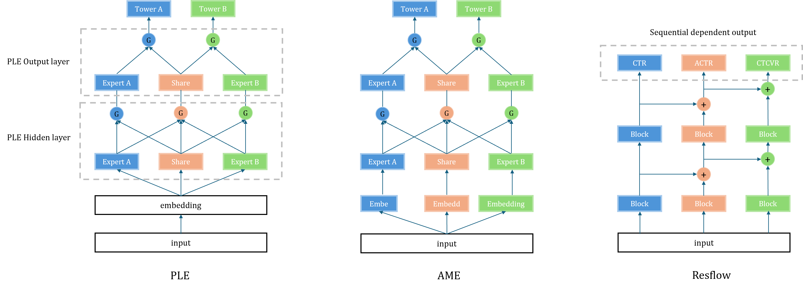
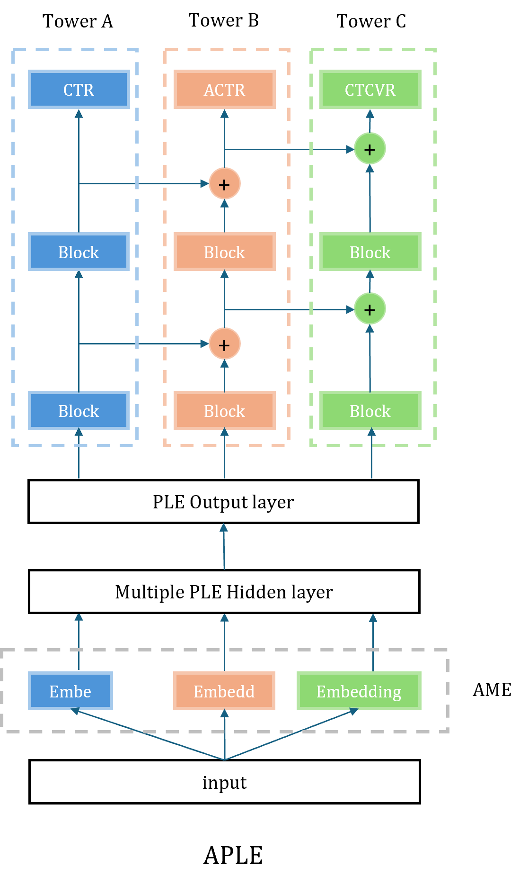

# APLE
PLE + AME + ResFlow

#### Background

In the embedding side, `multi-embedding` alleviates task conflicts  by introducing different embeddings. However,  the symmetric design will lead to **interest entanglement** (it is difficult to distinguish the behavioral intentions of users under different tasks).

In the target side, `ESMM` alleviates the **sample selection bias** problem through causal modeling. `ESCM²`  further mitigates sample selection bias by introducing **counterfactual regularizers**. However, the above methods cannot be generalized to multiple tasks.

#### Data

Our experiments are based on the 1M video sub-dataset of  `Tenrec`  dataset, which contains

- 120 million samples
- 1 million users
- 2 million items
- Tens of millions of clicks
- Millions of likes
- Hundreds of thousands of shares and follows

There are a total of 16 features (such as age, gender, item category, user behaviors sequence, etc.).

#### Architecture

The network architecture of `PLE`  `AME` and `Resflow` is below:

We combine these 3 model, and form our model as follow:

    

#### Works

- Improved the datapipeline in the Tenrec framework to support more than three tasks.
- Enhanced the PLE by adopting an **AME** design on top of multi-embedding. The asymmetric structure prevents different tasks from sharing the exact same representation space, thus <u>eliminating the interest entanglement caused by symmetry</u>.
- introduced **lateral residual connections** (Residual Inter-Task Block) in the tower structure. This models the sequential relationships between tasks (click → like → share) without increasing the number of parameters, thereby <u>alleviating sample selection bias and under-training due to data sparsity</u>.
- Reproduced and compared multi-task learning baselines such as MMOE (Multi-gate Mixture-of-Experts), ESMM (Entire Space Multi-task Model), Shared Bottom, and PLE.

> TODO:
>
> Using multi-head mapping and matrix factorization to replace multiple embedding matrices to reduce the number of parameters.
>
> Perform some weighted debiasing on the target.

#### Performance

The metrics of our model and baseline model are below:

|               | Share-Bottom | MMOE  |   ESMM    |  PLE  |   APLE    |
| :-----------: | :----------: | :---: | :-------: | :---: | :-------: |
| **click AUC** |    0.676     | 0.706 |   0.513   | 0.700 | **0.727** |
| **like AUC**  |    0.764     | 0.763 | **0.855** | 0.810 |   0.833   |
